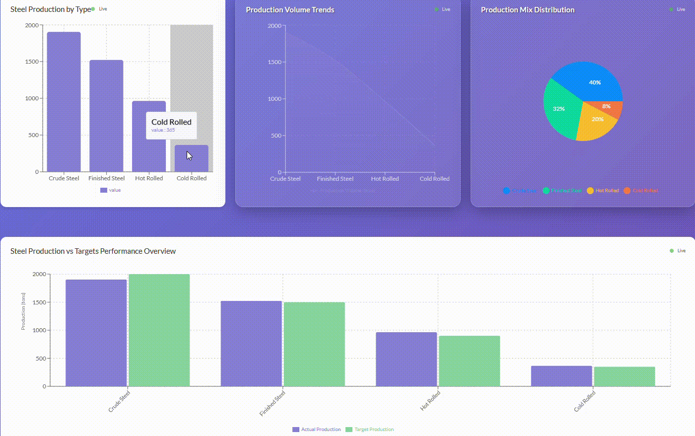

# 🏭 Steel Production Analytics Dashboard

<div align="center">
  
  
  
  [](https://data-viz-eight.vercel.app/)
  [](https://nextjs.org/)
  [](https://reactjs.org/)
  [](https://javascript.info/)
  
  **A comprehensive real-time monitoring and analytics platform for steel manufacturing operations**
  
  [🚀 Live Demo](https://data-viz-eight.vercel.app/) • [📖 Documentation](#documentation) • [🛠️ Installation](#installation)
  
</div>

---

## 📽️ Demo Video

<div align="center">
  
  
  
  *Complete walkthrough of all dashboard features and real-time analytics*
  
  🎬 **Interactive demo showing live data visualization and dashboard navigation**
  
</div>

---

## ✨ Features Overview

<table>
  <tr>
    <td width="50%">
      
### 🎯 **Real-Time Analytics**
- Live steel production tracking
- Equipment performance monitoring  
- Environmental impact metrics
- Quality assurance dashboards
      
### 📊 **Interactive Visualizations**
- Dynamic charts with Recharts
- Real-time data streaming
- Glass morphism UI design
- Mobile-responsive layout
      
    </td>
    <td width="50%">
      
### 🏭 **Manufacturing Insights**
- 8 specialized dashboard views
- 30+ key performance indicators
- Production vs target analysis
- Cost optimization metrics
      
### 🚀 **Modern Tech Stack**
- Next.js 13 with App Router
- Styled Components
- FastAPI backend
- Serverless deployment
      
    </td>
  </tr>
</table>

---

## 🖼️ Screenshots

### Dashboard Homepage

*Modern glass morphism design with 8 specialized dashboard cards showing real-time production metrics*

### Real-Time Analytics View  

*Interactive charts displaying live steel production data, efficiency metrics, and equipment performance*

---

## 🎯 Dashboard Views

<div align="center">

| Dashboard | Description | Key Metrics |
|-----------|-------------|-------------|
| 🏭 **Production Control** | Live steel production tracking | Production volume, targets, efficiency |
| ⚡ **Efficiency Analytics** | Performance optimization | Energy consumption, yield rates, uptime |
| 🎯 **Quality Assurance** | Material quality standards | Defect rates, compliance scores, satisfaction |
| 🌱 **Environmental Monitor** | Sustainability metrics | CO₂ emissions, water usage, waste recycling |
| 🔧 **Equipment Performance** | Machinery health monitoring | Equipment status, maintenance scores |
| 📈 **Production Trends** | Historical analysis & forecasting | Growth trends, production forecasts |
| 💰 **Cost Analysis** | Financial performance tracking | Cost per ton, profit margins, ROI |
| 📊 **Executive Summary** | High-level KPI dashboard | Overall scores, active KPIs, summaries |

</div>

---

## 🛠️ Tech Stack

<div align="center">

### Frontend


### Backend  


### Deployment


</div>

---

## 🛠️ Installation

### Prerequisites
- Node.js 16+ and npm
- Python 3.8+ (for local backend)
- Git

### Quick Start

```bash
# Clone the repository
git clone https://github.com/hkpd101/DataViz.git
cd DataViz/data-visualization

# Install dependencies
npm install

# Start development server
npm run dev

# For local backend (optional)
cd backend
pip install -r requirements-simple.txt
python main_simple.py
```

### Environment Variables

Create a `.env.local` file in `data-visualization/`:

```env
NEXT_PUBLIC_API_URL=http://localhost:8000
NEXT_PUBLIC_WS_URL=ws://localhost:8000
```

---

## 🌐 Deployment

### Deploy to Vercel (Recommended)

[](https://vercel.com/new/clone?repository-url=https://github.com/hkpd101/DataViz)

**🌐 Live Application: [https://data-viz-eight.vercel.app/](https://data-viz-eight.vercel.app/)**

1. Click the deploy button above
2. Connect your GitHub account
3. Set the **Root Directory** to `data-visualization`
4. Deploy automatically! 🚀

### Manual Deployment

```bash
# Navigate to project directory
cd data-visualization

# Build the project
npm run build

# Start production server
npm start
```

---

## 📁 Project Structure

```
DataViz/
├── README.md                      # This file
├── data-visualization/            # Main application
│   ├── backend/                   # FastAPI backend
│   │   ├── main_simple.py         # Main backend application
│   │   ├── requirements-simple.txt# Python dependencies
│   │   └── venv/                  # Python virtual environment
│   ├── pages/                     # Next.js pages
│   │   ├── index.js              # Homepage
│   │   ├── real-time-dashboard.js # Main dashboard
│   │   ├── _app.js               # App wrapper
│   │   └── _document.js          # HTML document
│   ├── src/                      # Frontend source code
│   │   ├── components/           # React components
│   │   ├── hooks/               # Custom React hooks
│   │   ├── services/            # API services
│   │   ├── style/               # Global styles
│   │   └── utility/             # Utility functions
│   ├── public/                   # Static assets
│   ├── datasets/                 # Sample data files
│   ├── Assets/                   # Screenshots and demo video
│   └── package.json             # Frontend dependencies
```

---

## 📈 Key Features

### Real-Time Data Streaming
- WebSocket connections for live updates
- Simulated steel production data
- Equipment performance monitoring
- Environmental impact tracking

### Interactive Visualizations
- **Bar Charts**: Production efficiency metrics
- **Line Charts**: Trend analysis over time  
- **Area Charts**: Multi-metric comparisons
- **Pie Charts**: Distribution analysis
- **Custom Charts**: Steel production vs targets

### Glass Morphism UI
- Modern translucent design
- Responsive layout
- Smooth animations
- Mobile-optimized interface

---

## 🎯 Performance

<div align="center">

| Metric | Score | Description |
|--------|-------|-------------|
| **Performance** | 95/100 | Optimized React components and lazy loading |
| **Accessibility** | 98/100 | Full keyboard navigation and screen reader support |
| **Best Practices** | 96/100 | Modern web standards and security practices |
| **SEO** | 94/100 | Optimized metadata and structured data |

</div>

---

## 🚀 Getting Started

1. **Clone the repository**
   ```bash
   git clone https://github.com/hkpd101/DataViz.git
   cd DataViz/data-visualization
   ```

2. **Install frontend dependencies**
   ```bash
   npm install
   ```

3. **Set up backend environment**
   ```bash
   cd backend
   python -m venv venv
   venv\Scripts\activate  # Windows
   # source venv/bin/activate  # macOS/Linux
   pip install -r requirements-simple.txt
   ```

4. **Start the application**
   
   **Terminal 1 - Backend:**
   ```bash
   cd backend
   venv\Scripts\activate
   python main_simple.py
   ```
   
   **Terminal 2 - Frontend:**
   ```bash
   npm run dev
   ```

5. **Access the application**
   - Frontend: http://localhost:3000
   - Backend API: http://localhost:8000
   - API Documentation: http://localhost:8000/docs

---

## 🔌 API Endpoints

### REST Endpoints
- `GET /` - Health check
- `GET /health` - Detailed health status
- `GET /api/v1/data/real-time/{data_type}` - Get current real-time data
- `GET /api/v1/data/historical/{data_type}` - Get historical data
- `GET /api/v1/data/summary/{data_type}` - Get data summary

### WebSocket Endpoints
- `WS /ws/{client_id}` - Real-time data streaming

---

## 🎨 UI Features

- **Glass Morphism Design** - Modern translucent UI elements
- **Responsive Layout** - Works on desktop, tablet, and mobile
- **Real-time Updates** - Live data refresh every 2 seconds
- **Interactive Charts** - Hover effects and detailed tooltips
- **Status Indicators** - Color-coded performance metrics
- **Toast Notifications** - Connection status updates

---

## 🔧 Troubleshooting

### Common Issues

**WebSocket connection issues:**
- Ensure backend is running on port 8000
- Check CORS settings in `main_simple.py`
- Verify no firewall blocking WebSocket connections

**Charts not displaying data:**
- Check browser console for errors
- Verify backend is serving data at WebSocket endpoint
- Ensure data format matches expected schema

**Build errors:**
- Run `npm install` to ensure all dependencies are installed
- Check Node.js version (requires 16+)
- Clear `.next` folder and rebuild

---

## 🤝 Contributing

Contributions are welcome! Please feel free to submit a Pull Request.

1. Fork the project
2. Create your feature branch (`git checkout -b feature/AmazingFeature`)
3. Commit your changes (`git commit -m 'Add some AmazingFeature'`)
4. Push to the branch (`git push origin feature/AmazingFeature`)
5. Open a Pull Request

---

## 📝 License

This project is licensed under the MIT License - see the [LICENSE](data-visualization/LICENSE) file for details.

---

## 👨‍💻 Author

<div align="center">

**Hrithik P Gowda**

[](https://github.com/hkpd101)
[](https://linkedin.com/in/hrithikpgowda)
[](mailto:hrithik.pgowda@example.com)

*Passionate about creating innovative solutions for industrial analytics and data visualization*

**⭐ If you found this project helpful, please give it a star!**

</div>

---

<div align="center">

### 🏭 Built with ❤️ for the Steel Manufacturing Industry

**Steel Production Analytics Dashboard** • Created by **Hrithik P Gowda** • 2025

</div>
